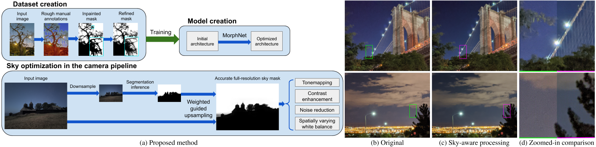

# Sky Optimization: Semantically aware image processing of skies in low-light photography

NTIRE CVPRW 2020

Website: https://google.github.io/sky-optimization/

Authors: [Orly Liba](https://sites.google.com/corp/view/orly-liba/),
[Longqi Cai](https://www.linkedin.com/in/longqicai/en-us),
[Yun-Ta Tsai](https://ai.google/research/people/105312/),
[Elad Eban](https://research.google/people/EladEban/),
[Yair Movshovitz-Attias](https://research.google/people/YairMovshovitzAttias/),
[Yael Pritch](https://scholar.google.com/citations?user=2jXxOYQAAAAJ),
[Huizhong Chen](https://www.linkedin.com/in/huizhong-chen-00776432),
[Jonathan T. Barron](https://jonbarron.info/)

